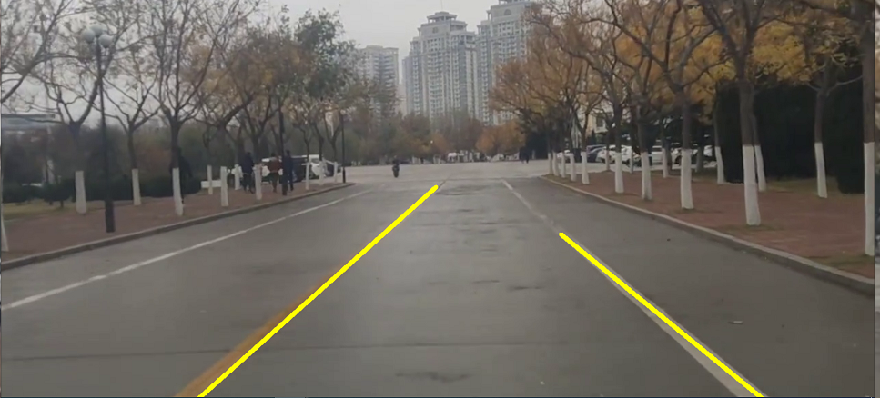

# Lane-detection-algorithm-based-on-OpenCV
基于OpenCV的车道线检测算法（传统算法） 
说明： 
* 将所有的操作封装在utility_zqy.py中
* main函数则调用utility_zqy中的show_lines函数
* 对vedio目录下的vedion_01.flv进行车道线检测
* 开发文档的md文件和pdf文件均在根目录下，具体操作自阅 
最终将视频的每一帧进行车道线检测，得到类似结果图：

 
注意：如果使用其他视频文件，需要在utility_zqy中先修改关键点的坐标，
以及修改Canny检测中的上下阈值
 
<h5 align="right"> zqy 2022/4/18</5>
 
----

