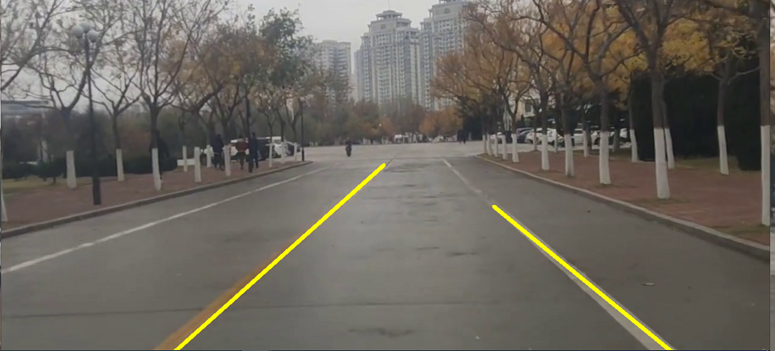
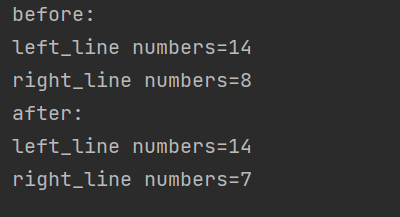

# 基于OpenCV的车道线检测算法
<h4 align="right">ZhengQinYuan</h4>

## 一.说明
### 1.原始数据
* 视频流文件vedion_01.flv
* 视频流中的单张图片(用以训练)


<b>注意：本文从第二部分开始均是对<a style="color:red">单张图片</a>进行处理，最后进行视频处理其实是把每一帧都当成一张图片</b>

### 2.预期效果
能识别路中央的车道线,以下为最终结果图


### 3.整体思路
使用OpenCV中的VideoCapture()方法捕获视频的每一帧，将每一帧当作一张图片，并进行以下处理：

### 4.附录
附录包含以下文件:
* 获取像素点坐标.py
* Canny动态调节阈值.py
* utility_zqy.py（封装所有的操作）
* 整体代码.py

### 5.实验环境说明
* python 3.9.4
* pip 22.0.4
* opencv 4.5.5

## 二.图像预处理
### 2.1 图像导入
使用灰度图读取图片
#### 2.1.1 train.png
如果使用给定的train.png图片，则使用opencv导入
```
import cv2 #导入opencv
#以灰度图读取图片
color_img=cv2.imread('train02.png',cv2.IMREAD_GRAYSCALE)
```
#### 2.1.2 vedion_01.flv
如果读取视频vedion_01.flv的一帧作为图片,则先使用OpenCV中的VideoCapture()函数捕获视频，然后使用read()函数读取一帧，最后使用cvtColor()将图片转换为灰度图

```
capture = cv2.VideoCapture(filename)
ret, color_img = capture.read() #在这里color_img的类型不是str
train_img = cv2.cvtColor(color_img, cv2.IMREAD_GRAYSCALE)
```
### 2.2 边缘处理
使用Canny边缘检测算子，在保留原有图像属性的情况下，减少图像的数据规模。算法步骤如下：
* 用高斯滤波来平滑图像，去除噪声 - GaussianBlur
* 寻找图像的强度梯度 – Sobel/Scharr
* 应用非最大抑制技术来消除边误检 
* 用双阈值的方法来决定可能的边界
* 使用滞后技术来跟踪边界<br>
 <1>若某一像素位置的幅值超过高阈值，该像素被保留为边缘像素<br>
 <2>若某一像素位置的幅值小于低阈值，该像素被排除<br>
 <3>若某一像素位置的幅值在两者之间，该像素仅仅在连接到一个高于高阈值的时候被保留<br>

本项目直接使用OpenCV中的Canny()函数来进行边缘检测,具体操作如下：
Ⅰ.通过`Canny动态调节阈值.py`<a style="color:red">（在附录）</a>获取较合理的上下阈值

设置上下阈值为33和101
Ⅱ.使用cv2.Canny()进行边缘检测
```
edge_img = cv2.Canny(train_img, 33, 101)  # 可以调整上下阈值
```
得到如下结果：


---

## 三.特征检测
### 3.1 获取掩码
Ⅰ.通过`获取像素点坐标.py`(在附录)获取车道线分布概率较高区域关键点的坐标

得到坐标列表`[115, 686], [498, 368], [756, 341], [1178, 687]`
Ⅱ.使用fillPoly()函数获取掩码
```
mask = np.zeros_like(edge_img)  # 获取一样的数组
# 得到掩码
mask = cv2.fillPoly(mask, np.array([[[115, 686], [498, 368], [756, 341], [1178, 687]]]),
                            color=255)
```
得到掩码区域如下

---
### 3.2 获取ROI区域
将上述的掩码mask和原图进行按位与操作
```
masked_edges_img = cv2.bitwise_and(edge_img, mask)  # 原图，掩码
```
得到如下结果：


### 3.3 获取直线
Ⅰ.使用霍夫变换获取直线

```
lines = cv2.HoughLinesP(masked_edges_img, 1, np.pi / 180, 15, minLineLength=40, maxLineGap=20)
```
然后会得到两组线段，按照斜率的正负划分为左右线段
```
# 按照斜率分成左右车道线
left_lines = [line for line in lines if calculate_slope(line) > 0]
right_lines = [line for line in lines if calculate_slope(line) < 0]
```
但是这样子会检测多条直线，打印现在左右线段的数量如下：


Ⅱ.离群值滤波和最小二乘拟合
通过计算出所有线段的斜率平均值以及差值，剔除掉差值较大者的线段，然后将得到的结果进行最小二乘拟合，优化检测结果
#### 【1】离群值过滤
```
def reject_abnormal_lines(lines, threshold): 
    # [1]计算出所有的斜率
    slopes = [calculate_slope(line) for line in lines]
    while len(lines) > 0:
        # [2]计算斜率的平均值
        mean = np.mean(slopes)
        # [3]计算斜率与平均值的差值
        diff = [abs(s - mean) for s in slopes]
        # [4]找到差值最大的下标
        idx = np.argmax(diff)
        if diff[idx] > threshold:
            # 5.5 删除掉这条线段
            slopes.pop(idx)
            lines.pop(idx)
        else:
            break
    return lines

```
#### 【2】最小二乘拟合

```
def least_squares_fit(lines):  

    # 将lines中的线段拟合成一条线段
    # lines:线段集合,[np.array([[x_1,y_1,x_2,y_2]]),np.array([[x_1,y_1,x_2,y_2]])],...]
    # 线段上的两点,np.array([[xmin,ymin],[xmax,ymax]])

    # 取出所有坐标点
    x_coords = np.ravel([[line[0][0], line[0][2]] for line in lines])
    y_coords = np.ravel([[line[0][1], line[0][3]] for line in lines])
    # 进行直线拟合，得到多项式系数
    poly = np.polyfit(x_coords, y_coords, deg=1)  # 因为直线是一次曲线，所以deg=1
    # 根据多项式系数，计算两个直线上的点，用于唯一确定这条直线
    point_min = (np.min(x_coords), np.polyval(poly, np.min(x_coords)))
    point_max = (np.max(x_coords), np.polyval(poly, np.max(x_coords)))
    return np.array([point_min, point_max], dtype=np.int)
```
使用离群值滤波和最小二乘拟合，对线段列表进行处理，得到如下结果：

测试代码如下：
```
print('before:')
print('left_line numbers='+str(len(left_lines)))
print('right_line numbers='+str(len(right_lines)))

# 4.离群值过滤
left_lines = reject_abnormal_lines(left_lines, 0.2)
right_lines = reject_abnormal_lines(right_lines, 0.2)
# 5.最小二乘拟合
left_line = least_squares_fit(left_lines)
right_line = least_squares_fit(right_lines)
print('after:')
print('left_line numbers='+str(len(left_lines)))
print('right_line numbers='+str(len(right_lines)))
```

---

## 四.车道模型拟合
用tuple()函数将线段列表转换为元组，用cv2.line()函数在原图上绘制直线
```
cv2.line(color_img, tuple(left_line[0]), tuple(left_line[1]), color=(0, 255, 255), thickness=5)
cv2.line(color_img, tuple(right_line[0]), tuple(right_line[1]), color=(0, 255, 255), thickness=5)
cv2.imshow('1', color_img)
cv2.waitKey(speed)
```
得到效果图如下：


笔者将上述所有的函数封装为：utility_zqy.py
最终对视频进行处理：
```
import  utility_zqy
import cv2
#两个参数：视频流文件，速度（一般在10-100）
# utility_zqy.show_lines('vedion_01.flv',20)
print(cv2.__version__)
```
---
## 附录

* 获取像素点坐标.py
```
import cv2

def get_point(event, x, y, flags, param):
    # 鼠标单击事件
    if event == cv2.EVENT_LBUTTONDOWN:
        # 输出坐标
        print('坐标值: ', x, y)
        # 在传入参数图像上画出该点
        #cv2.circle(param, (x, y), 1, (255, 255, 255), thickness=-1)
        img = param.copy()
        # 输出坐标点的像素值
        print('像素值：',param[y][x]) # 注意此处反转，(纵，横，通道)
        # 显示坐标与像素
        text = "("+str(x)+','+str(y)+')'+str(param[y][x])
        cv2.putText(img,text,(0,param.shape[0]),cv2.FONT_HERSHEY_PLAIN,1.5,(0,0,255),1)
        cv2.imshow('image', img)
        cv2.waitKey(0)

if __name__ == "__main__":
    # 定义两幅图像
    image = cv2.imread('train02.png')
    # image = cv2.cvtColor(image,cv2.COLOR_BGR2GRAY)

    # 定义两个窗口 并绑定事件 传入各自对应的参数
    cv2.namedWindow('image')
    resize_img = cv2.resize(image,(50,20))
    cv2.setMouseCallback('image', get_point, resize_img)
    # 显示图像
    while(True):
        cv2.imshow('image', image)
        if cv2.waitKey(20) & 0xFF == 27:
            break


```

* Canny动态调节阈值.py
```
import cv2

cv2.namedWindow('edge_detection')
cv2.createTrackbar('minThreshold','edge_detection',50,1000,lambda x:x)
cv2.createTrackbar('maxThreshold','edge_detection',100,1000,lambda x:x)

capture=cv2.VideoCapture('vedion_01.flv')
ret,img=capture.read()
img=cv2.cvtColor(img,cv2.IMREAD_GRAYSCALE)
# img = cv2.imread('train02.png',cv2.IMREAD_GRAYSCALE)

while True:
    minThreshold=cv2.getTrackbarPos('minThreshold','edge_detection')
    maxThreshold=cv2.getTrackbarPos('maxThreshold','edge_detection')
    edges=cv2.Canny(img,minThreshold,maxThreshold)
    cv2.imshow('edge_detection',edges)
    cv2.waitKey(10)

```
* utility_zqy.py
```
import cv2
import numpy as np
from PIL import Image

# *******************工具函数*****************#
def calculate_slope(line):  # 计算线段line的斜率
    x_1, y_1, x_2, y_2 = line[0]
    return (y_2 - y_1) / (x_2 - x_1)


def reject_abnormal_lines(lines, threshold):  # 离群值过滤
    # [1]计算出所有的斜率
    slopes = [calculate_slope(line) for line in lines]
    while len(lines) > 0:
        # [2]计算斜率的平均值
        mean = np.mean(slopes)
        # [3]计算斜率与平均值的差值
        diff = [abs(s - mean) for s in slopes]
        # [4]找到差值最大的下标
        idx = np.argmax(diff)
        if diff[idx] > threshold:
            # 5.5 删除掉这条线段
            slopes.pop(idx)
            lines.pop(idx)
        else:
            break
    return lines


def least_squares_fit(lines):  # 最小二乘拟合

    # 将lines中的线段拟合成一条线段
    # lines:线段集合,[np.array([[x_1,y_1,x_2,y_2]]),np.array([[x_1,y_1,x_2,y_2]])],...]
    # 线段上的两点,np.array([[xmin,ymin],[xmax,ymax]])

    # 取出所有坐标点
    x_coords = np.ravel([[line[0][0], line[0][2]] for line in lines])
    y_coords = np.ravel([[line[0][1], line[0][3]] for line in lines])
    # 进行直线拟合，得到多项式系数
    poly = np.polyfit(x_coords, y_coords, deg=1)  # 因为直线是一次曲线，所以deg=1
    # 根据多项式系数，计算两个直线上的点，用于唯一确定这条直线
    point_min = (np.min(x_coords), np.polyval(poly, np.min(x_coords)))
    point_max = (np.max(x_coords), np.polyval(poly, np.max(x_coords)))
    return np.array([point_min, point_max], dtype=np.int)


# -----end--#

# 主要函数： 对视频流进行处理
def show_lines(filename,speed):# 视频流文件，速度
    capture = cv2.VideoCapture(filename)
    while True:
        ret, color_img = capture.read()
        # 在这里color_img的类型不是str,即不是图片的链接，而是图片本身
        train_img = cv2.cvtColor(color_img, cv2.IMREAD_GRAYSCALE)
        # 1.Canny边缘检测
        edge_img = cv2.Canny(train_img, 33, 101)  # 可以调整上下阈值
        # 2.获取ROI区域 坐标：[2,369],[231,157],[339,92],[567,102],[750,240],[944,386]
        mask = np.zeros_like(edge_img)  # 获取一样的数组
        # 2.1得到掩码
        mask = cv2.fillPoly(mask, np.array([[[115, 686], [498, 368], [756, 341], [1178, 687]]]),
                            color=255)
        # 2.2ROI区域
        masked_edges_img = cv2.bitwise_and(edge_img, mask)  # 原图，掩码
        # 3.霍夫变换
        lines = cv2.HoughLinesP(masked_edges_img, 1, np.pi / 180, 15, minLineLength=40, maxLineGap=20)
        # 按照斜率分成左右车道线
        left_lines = [line for line in lines if calculate_slope(line) > 0]
        right_lines = [line for line in lines if calculate_slope(line) < 0]
        # 4.离群值过滤
        left_lines = reject_abnormal_lines(left_lines, 0.2)
        right_lines = reject_abnormal_lines(right_lines, 0.2)
        # 5.最小二乘拟合
        left_line = least_squares_fit(left_lines)
        right_line = least_squares_fit(right_lines)
        # 6.绘制图片
        # img_02 = cv2.imread(color_img, cv2.IMREAD_COLOR)
        cv2.line(color_img, tuple(left_line[0]), tuple(left_line[1]), color=(0, 255, 255), thickness=5)
        cv2.line(color_img, tuple(right_line[0]), tuple(right_line[1]), color=(0, 255, 255), thickness=5)

        cv2.imshow('1', color_img)
        cv2.waitKey(speed)
```
* 整体代码.py
```
import  utility_zqy
import cv2
#两个参数：视频流文件，速度（一般在10-100）
# utility_zqy.show_lines('vedion_01.flv',20)
print(cv2.__version__)
```

---
<h5 align="right">made by zqy<br> 2022/4/18</h5>
